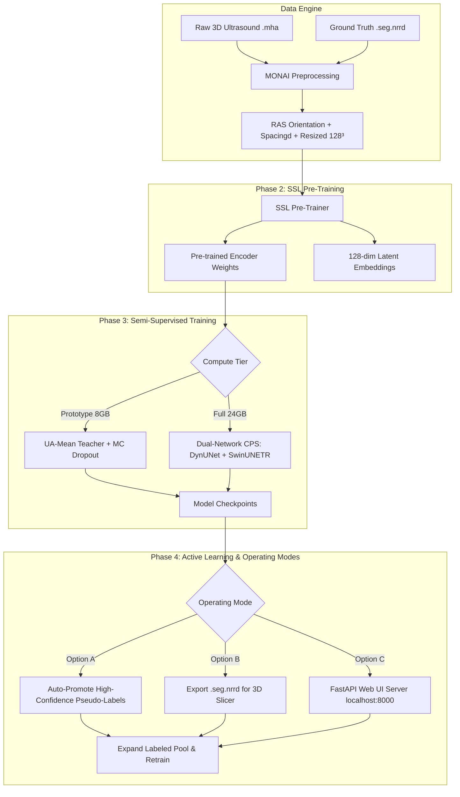

<div align="center">

# HASSL: Hybrid Active Semi-Supervised Learning
### Efficient 3D B-Mode Ultrasound Segmentation with Minimal Manual Labels

[](https://www.python.org/downloads/)
[](https://monai.io/)
[](https://pytorch.org/)
[](LICENSE)

</div>

---

## 📌 Overview

**HASSL (Hybrid Active Semi-Supervised Learning)** is a MONAI-native deep learning framework specifically designed for **3D B-Mode Ultrasound images**. 

When faced with a dataset of **~300 3D volumes where only 50 are labeled**, traditional supervised learning overfits, and basic active learning picks redundant or noisy scans. HASSL resolves this by integrating **Self-Supervised Pre-training (SSL)**, **Consistency-Regularized Semi-Supervised Learning (SSL)**, and **Hybrid Active Learning (AL)** into a single unified framework.

---

## ✨ Key Features

- **🧠 Self-Supervised Pre-Training**: Pre-trains UNet / DynUNet encoders on all 300 unlabeled 3D volumes using Masked Volume Inpainting (30%), InfoNCE Contrastive Learning, and 3D Rotation Prediction.
- **⚡ Dual-Compute Tier Architecture**:
  - **Prototype Mode (8GB VRAM GPU)**: Uses Uncertainty-Aware Mean Teacher (UA-MT), AMP mixed precision, and MC Dropout variance masking (~6.2 GB VRAM).
  - **Full Mode (24GB VRAM GPU)**: Scales to dual-network Cross-Pseudo Supervision (DynUNet + SwinUNETR transformer) (~18.5 GB VRAM).
- **🎯 Hybrid Active Learning Strategy**: Selects the most informative volumes using a fused score:
  $$\text{Score} = 0.4 \cdot \text{BALD (Uncertainty)} + 0.3 \cdot \text{CoreSet (Diversity)} + 0.3 \cdot \text{Disagreement}$$
- **🔄 3 Flexible Operating Modes**:
  - **Option A (Fully Automated)**: 100% hands-free pseudo-label promotion & retraining loop.
  - **Option B (3D Slicer)**: Exports `.seg.nrrd` pre-segmentations for desktop review in 3D Slicer.
  - **Option C (Browser Web UI)**: Embedded FastAPI + JS canvas slice viewer (`http://localhost:8000`) for one-click label review.
- **🏥 Medical Format Native**: Built-in `.seg.nrrd` 3D Slicer segment metadata parser (`pynrrd`) and `.mha` SimpleITK loader.
- **🧪 Comprehensive Test Suite**: 8 CPU unit test modules covering config, dataloaders, loss functions, network passes, and query strategies.

---

## 🏗️ System Architecture



---

## 🚀 Quick Start

### 1. Installation

```bash
git clone git@github.com:adityasingh1993/ActiveLearning.git
cd ActiveLearning
pip install -r requirements.txt
```

### 2. Prepare Your Data (or Generate Synthetic Data)

#### Option 2A: Generate Synthetic 3D Ultrasound Data (For Testing)
```bash
python -m hassl.utils.synthetic_data --output ./data --num-volumes 20 --num-labeled 5
```

#### Option 2B: Use Real Data
Place your dataset inside `data/`:
```
data/
├── images/    <-- Place all ~300 image volumes (.mha files)
└── labels/    <-- Place your initial 50 label volumes (.seg.nrrd files)
```

---

## 🎮 How to Run (Choose Your Operating Mode)

### 🤖 Option A: Fully Automated Self-Training (Zero Manual Labor)
Train and automatically promote high-confidence pseudo-labels **100% hands-free**:
```bash
python -m hassl.pipeline --config config.yaml --phase auto-loop
```

---

### 🖥️ Option B: 3D Slicer Desktop Workflow
Export AI pre-segmentations, review in 3D Slicer, and trigger active learning rounds:
```bash
# Step 1: Run SSL & Initial Training
python -m hassl.pipeline --config config.yaml --phase all

# Step 2: Open 3D Slicer, correct pre-segmentations in data/al_preseg/, save to data/labels/

# Step 3: Retrain on expanded label pool
python -m hassl.pipeline --config config.yaml --phase al-round --round 1
```

---

### 🌐 Option C: Browser-Based Web UI (No 3D Slicer Required)
Launch the local web application to review slices right in Chrome/Edge:
```bash
python -m hassl.pipeline --config config.yaml --phase serve
```
1. Open **`http://localhost:8000`** in your browser.
2. Scroll through 2D slices along **Axial**, **Coronal**, or **Sagittal** planes.
3. Use keyboard shortcuts: `1`/`2`/`3` (switch view), `A` (accept label), `R` (reject), `N` (next volume).
4. Click **"🔄 Retrain Model"** in the top header when finished reviewing a batch.

---

## ⚙️ Configuration Knobs

Configure hardware and network backbones in `config.yaml`:

```yaml
# Compute Mode: "prototype" (8GB VRAM) or "full" (24GB VRAM)
compute_mode: "prototype"

# Network Backbone: "dynunet" or "unet"
unet_backbone: "dynunet"

# Data Resizing & Resolution Spacing
spatial_size: [128, 128, 128]
spacing: [0.1, 0.1, 0.1]

# Experiment Tracking: "wandb", "mlflow", or "none"
tracker: "wandb"
```

---

## 🧪 Running Unit Tests

Run the Pytest suite to verify dataset loaders, network forward passes, custom losses, and active learning algorithms:

```bash
pytest tests/
```

---

## 📁 Repository Structure

```
ActiveLearning/
├── README.md                       ← Project Overview & Quick Start
├── config.yaml                     ← Prototype config (8GB GPU)
├── config_full.yaml                ← Full config (24GB GPU)
├── execution_guide.md              ← Detailed step-by-step CLI & Web UI manual
├── architecture_and_design_decisions.md ← High-Level & Low-Level Design (HLD/LLD)
├── flow_and_decision_design.md    ← Sequence diagrams & loss formulations
├── requirements.txt                ← Dependencies
├── hassl/
│   ├── config.py                   ← Central YAML dataclass config
│   ├── pipeline.py                 ← Main CLI orchestrator
│   ├── tracking.py                 ← WandB / MLflow unified interface
│   ├── data/
│   │   ├── data_engine.py          ← MONAI dataset & dataloader builders
│   │   ├── nrrd_utils.py           ← .seg.nrrd 3D Slicer segment metadata parser
│   │   └── augmentations.py        ← Weak / Strong / CutMix3D augmentations
│   ├── ssl/
│   │   ├── ssl_pretrainer.py       ← Masked inpainting + InfoNCE SSL pre-training
│   │   └── feature_extractor.py    ← Embedding extraction & t-SNE / UMAP plots
│   ├── training/
│   │   ├── trainer.py              ← Unified UA-MT / CPS semi-supervised trainer
│   │   ├── losses.py               ← DiceCE + FlexMatch + Boundary losses
│   │   └── ema.py                  ← EMA teacher model
│   ├── active/
│   │   ├── query_strategies.py     ← BALD + CoreSet + Disagreement + Hybrid strategy
│   │   └── query_engine.py         ← Manifest manager & auto pseudo-label promoter
│   ├── app/                        ← Option C: Browser Web UI
│   │   ├── server.py               ← FastAPI server for 2D slice streaming
│   │   └── static/                 ← HTML / CSS / JS frontend
│   └── utils/
│       ├── visualization.py        ← Prediction overlays & uncertainty heatmaps
│       └── synthetic_data.py       ← 3D ultrasound speckle noise dataset generator
└── tests/                          ← Pytest Unit Test Suite
```

---

## 📜 Documentation & Design Specifications

- 📘 [**Execution Guide**](execution_guide.md): Complete CLI & Web UI walkthrough.
- 📐 [**Architecture & Design Decisions**](architecture_and_design_decisions.md): HLD, LLD, and rationale.
- 🔄 [**Flow & Decision Specification**](flow_and_decision_design.md): Pipeline flowcharts & loss equations.

---

## 📄 License

Distributed under the MIT License. See `LICENSE` for more information.
