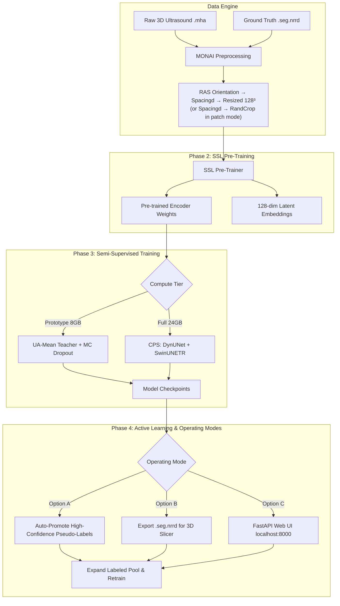

<div align="center">

# HASSL: Hybrid Active Semi-Supervised Learning
### Efficient 3D B-Mode Ultrasound Segmentation with Minimal Manual Labels

[](https://www.python.org/downloads/)
[](https://monai.io/)
[](https://pytorch.org/)
[](LICENSE)

</div>

---

## 📌 Overview

**HASSL (Hybrid Active Semi-Supervised Learning)** is a MONAI-native deep learning framework for **3D B-Mode Ultrasound segmentation** designed to work well with very few labels.

When faced with a dataset of **~300 3D volumes where only 50 are labeled**, traditional supervised learning overfits and basic active learning picks redundant or noisy scans. HASSL resolves this by integrating **Self-Supervised Pre-training (SSL)**, **Consistency-Regularized Semi-Supervised Training**, and **Hybrid Active Learning (AL)** into a single unified framework.

---

## ✨ Key Features

- **🧠 Self-Supervised Pre-Training**: Pre-trains UNet / DynUNet encoders on all unlabeled 3D volumes using Masked Volume Inpainting, InfoNCE Contrastive Learning, and 3D Rotation Prediction.
- **⚡ Dual-Compute Tier Architecture**:
  - **Prototype Mode (8GB VRAM)**: Uncertainty-Aware Mean Teacher (UA-MT) with EMA teacher, MC Dropout, AMP, and gradient checkpointing (~6.2 GB VRAM).
  - **Full Mode (24GB VRAM)**: Dual-network Cross-Pseudo Supervision (DynUNet + SwinUNETR) with FlexMatch dynamic thresholding (~18.5 GB VRAM).
- **🎯 Hybrid Active Learning**: Fused informativeness score:
  $$\text{Score} = 0.4 \cdot \text{BALD} + 0.3 \cdot \text{CoreSet} + 0.3 \cdot \text{Disagreement}$$
- **🔒 Dual Pseudo-Label Quality Gate**: Three-stage filter before any pseudo-label is promoted:
  - **Gate 1** — Min foreground confidence (`pseudo_confidence_threshold: 0.85`)
  - **Gate 2** — Max MC Dropout epistemic variance (`pseudo_mc_var_threshold: 0.05`)
  - **Gate 3** — Max TTA aleatoric variance (`pseudo_tta_var_threshold: 0.02`)
- **🔄 3 Flexible Operating Modes**: Fully Automated, 3D Slicer Desktop, or Browser Web UI.
- **🏥 Medical Format Native**: `.seg.nrrd` 3D Slicer segment metadata parser and `.mha` SimpleITK loader.

---

## 🏗️ System Architecture



---

## ⚙️ Preprocessing Pipeline

In the default `resize` mode, every volume passes through this chain before reaching the model:

```
LoadImage → EnsureChannelFirst → Orientationd(RAS)
  → Spacingd(config.spacing)
  → AsDiscreted(threshold=0.5)          [binary] or NormalizeLabelsInDatasetd [multiclass]
  → ScaleIntensityRangePercentilesd     [1–99 percentile → 0.0–1.0, channel-wise]
  → Resized(128, 128, 128)              [whole-volume fixed grid]
  → StrongAugmentation                  [train only]
```

For **patch mode** (`preprocessing_mode: "patch"`), `Resized` is replaced by `RandCropByPosNegLabeld(patch_size)` during training. Validation always uses `Resized(128, 128, 128)` in both modes.

---

## 🔍 Validation

Validation uses `SlidingWindowInferer(roi_size=spatial_size, overlap=0.25)`. In `resize` mode the validation volume is already 128³, so the inferer runs exactly **one window = one forward pass**. Metrics computed per epoch:

| Metric | Description |
|:---|:---|
| `val_dice` | Mean Dice (no post-processing) |
| `val_dice_lcc` | Mean Dice after Largest Connected Component filtering |
| `val_precision` / `val_recall` | Precision and Recall (no LCC) |
| `val_hd95` | 95th-percentile Hausdorff Distance (mm) |
| `val_rve_pct` | Relative Volume Error (%) in scanner-native mm³ |
| `val_volume_r2` | R² of predicted vs. ground-truth volume |

**Two visualization previews are logged** every `log_image_every_n_epochs` epochs:
- `val_slice_preview_model_space` — raw 128³ model input with prediction overlay
- `val_slice_preview_native_space` — scanner-native resolution via `Invertd` inversion

> **Note**: `val_dice_lcc = 0.0` in early epochs is expected. LCC post-processing zeros predictions smaller than `lcc_min_size_voxels` voxels. Monitor `val_dice` (no LCC) to judge early training progress.

---

## 🚀 Quick Start

### 1. Installation

```bash
git clone git@github.com:adityasingh1993/ActiveLearning.git
cd ActiveLearning
pip install -r requirements.txt
```

### 2. Prepare Data

#### Option A — Generate Synthetic Test Data
```bash
python -m hassl.utils.synthetic_data --output ./data --num-volumes 20 --num-labeled 5
```

#### Option B — Real Data
```
data/
├── images/    ← All 3D image volumes (.mha)
└── labels/    ← Labeled masks (.seg.nrrd)
```

> **Important**: Delete `data/splits.json` before the first run if you have changed your dataset. HASSL creates this file once and reuses it across rounds to ensure reproducible patient-level splits.

---

## 🎮 Operating Modes

### 🤖 Option A: Fully Automated (Zero Manual Labor)
```bash
python -m hassl.pipeline --config config.yaml --phase auto-loop
```

### 🖥️ Option B: 3D Slicer Desktop Workflow
```bash
# Step 1: Initial training
python -m hassl.pipeline --config config.yaml --phase all

# Step 2: Review & correct predictions in 3D Slicer, save to data/labels/

# Step 3: Retrain
python -m hassl.pipeline --config config.yaml --phase al-round --round 1
```

### 🌐 Option C: Browser Web UI
```bash
python -m hassl.pipeline --config config.yaml --phase serve
```
Open **`http://localhost:8000`** → scroll slices → `A` accept / `R` reject / `N` next volume → **🔄 Retrain Model**.

---

## ⚙️ Key Configuration

Two ready-to-use YAML files are provided:

| File | GPU | Mode | Architecture |
|:---|:---|:---|:---|
| `config.yaml` | 8GB | `prototype` | Single DynUNet + UA-Mean Teacher |
| `config_full.yaml` | 24GB | `full` | Dual-Network CPS (DynUNet + SwinUNETR) |

Critical defaults to be aware of:

```yaml
# Preprocessing
preprocessing_mode: "resize"       # "resize" (whole vol 128³) or "patch" (96³ crops)
spatial_size: [128, 128, 128]
spacing: [1.0, 1.0, 1.0]          # mm/voxel — set to your scanner's actual spacing

# Semi-supervised training
ema_decay: 0.99                    # 0.99 for small datasets (<100 labels); 0.999 for large
consistency_rampup_epochs: 80      # Epochs before unsupervised loss reaches full weight
train_lr: 1e-4
lr_scheduler: "cosine"
lr_warmup_epochs: 5

# Validation splits
val_split: 5                       # Number of patients held out for validation

# Pseudo-label gates
pseudo_confidence_threshold: 0.85
pseudo_mc_var_threshold: 0.05
pseudo_tta_var_threshold: 0.02
```

See [**Configuration Guide**](configuration_guide.md) for all 53 parameters.

---

## 📁 Repository Structure

```
ActiveLearning/
├── README.md                       ← Project overview (this file)
├── config.yaml                     ← Prototype config (8GB GPU)
├── config_full.yaml                ← Full config (24GB GPU)
├── configuration_guide.md          ← Complete parameter reference with pitfalls
├── execution_guide.md              ← Step-by-step CLI & Web UI manual with troubleshooting
├── architecture_and_design_decisions.md  ← HLD/LLD & design rationale
├── flow_and_decision_design.md     ← Pipeline flowcharts & loss equations
├── requirements.txt
├── hassl/
│   ├── config.py                   ← HASSLConfig dataclass (all 53 parameters)
│   ├── pipeline.py                 ← Main CLI orchestrator
│   ├── compat.py                   ← MONAI 1.4 / 1.5 compatibility layer
│   ├── tracking.py                 ← WandB / MLflow unified interface
│   ├── data/
│   │   ├── data_engine.py          ← Dataset builders, transforms, patient-level splits
│   │   ├── augmentations.py        ← Weak / Strong / Spatial / Intensity augmentations
│   │   ├── label_utils.py          ← NormalizeLabelsInDatasetd for multiclass remapping
│   │   └── nrrd_utils.py           ← .seg.nrrd 3D Slicer segment metadata parser
│   ├── ssl/
│   │   ├── ssl_pretrainer.py       ← Masked inpainting + InfoNCE SSL pre-training
│   │   └── feature_extractor.py    ← Embedding extraction & t-SNE / UMAP plots
│   ├── training/
│   │   ├── trainer.py              ← Unified UA-MT / CPS semi-supervised trainer
│   │   ├── losses.py               ← CombinedSegLoss (DiceCE) + UncertaintyMaskedLoss + BoundaryLoss
│   │   └── ema.py                  ← EMA teacher model & MC Dropout utilities
│   ├── active/
│   │   ├── query_strategies.py     ← BALD + CoreSet + Disagreement + Hybrid strategy
│   │   └── query_engine.py         ← Manifest manager & pseudo-label promoter
│   ├── app/                        ← Option C: Browser Web UI
│   │   ├── server.py               ← FastAPI server for 2D slice streaming
│   │   └── static/                 ← HTML / CSS / JS frontend
│   └── utils/
│       ├── visualization.py        ← Prediction overlays & uncertainty heatmaps
│       └── synthetic_data.py       ← 3D ultrasound speckle noise dataset generator
└── tests/                          ← Pytest unit test suite
```

---

## 🧪 Running Tests

```bash
pytest tests/
```

---

## 📜 Documentation

| Document | Description |
|:---|:---|
| [**Configuration Guide**](configuration_guide.md) | All 53 parameters with defaults, descriptions, and common pitfalls |
| [**Execution Guide**](execution_guide.md) | CLI walkthrough, Web UI manual, and troubleshooting |
| [**Architecture & Design**](architecture_and_design_decisions.md) | HLD, LLD, and design rationale |
| [**Flow & Decision Design**](flow_and_decision_design.md) | Pipeline flowcharts & loss equations |

---

## 📄 License

Distributed under the MIT License. See `LICENSE` for more information.
