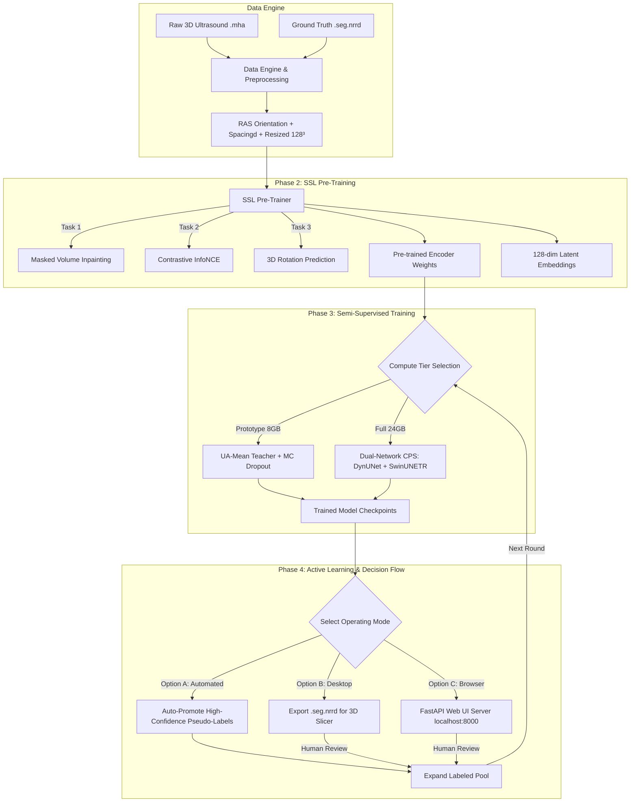
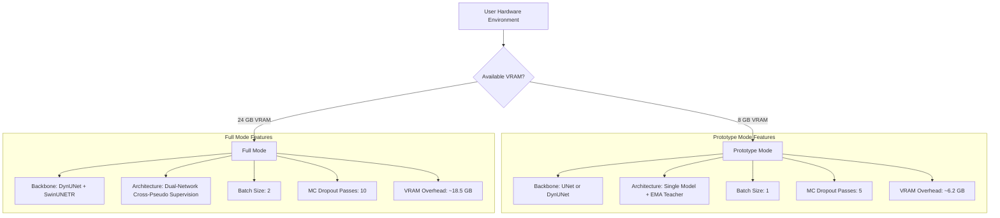
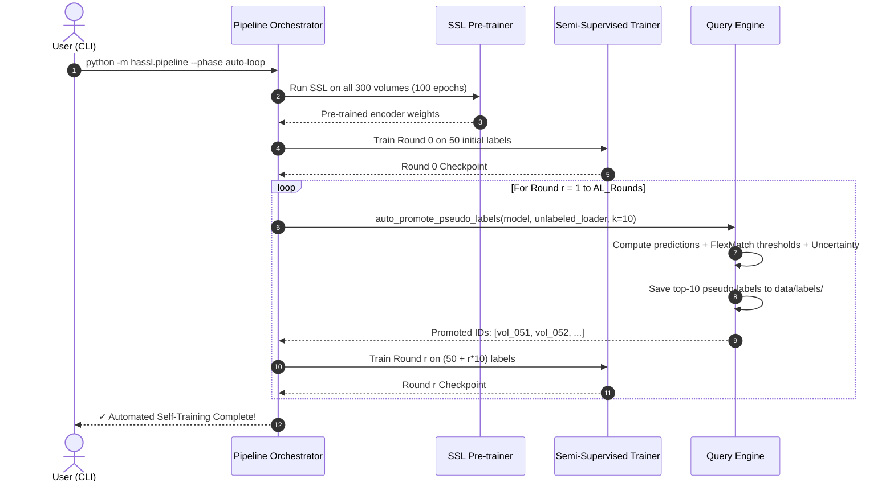
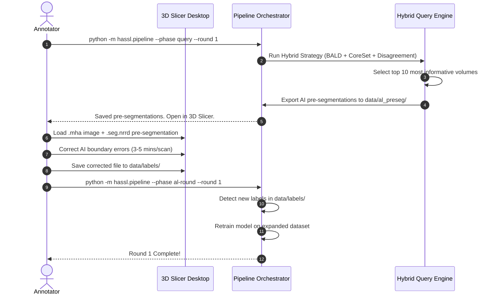
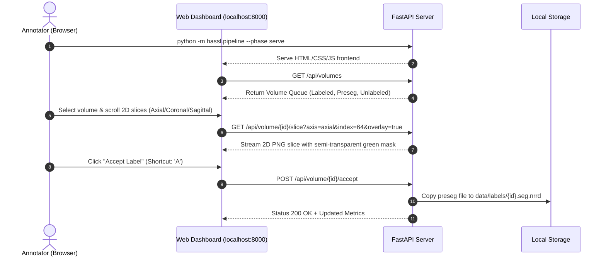

# HASSL: Hybrid Active Semi-Supervised Learning
## Flow Architecture & Decision Design Specification

---

## 1. System Overview

**HASSL** is a MONAI-native framework designed to segment 3D BMode Ultrasound volumes with maximum accuracy while reducing human manual labeling effort by 80–100%.

Given a dataset of **$N$ total 3D volumes** (e.g., $N = 300$) where only **$M$ volumes are labeled** (e.g., $M = 50$), HASSL combines:
1. **Self-Supervised Learning (SSL)**: Learns robust representations from all 300 unlabeled volumes.
2. **Semi-Supervised Learning (SSL)**: Leverages unlabeled data during training via UA-Mean Teacher (8GB VRAM) or Cross-Pseudo Supervision (24GB VRAM).
3. **Active Learning (AL)**: Selects the most informative volumes using a Hybrid strategy (BALD + CoreSet + Disagreement).
4. **Flexible Operating Modes**: Fully Automated Self-Training (Option A), 3D Slicer Integration (Option B), or Web UI Review (Option C).

---

## 2. End-to-End Pipeline Architecture



---

## 3. Decision Matrix & Configuration Logic

### 3.1 Compute Tier Decision Logic



### 3.2 Network Backbone Decision Logic

```mermaid
graph TD
    BB{Backbone Configuration} -->|unet| U[MONAI UNet]
    BB -->|dynunet| D[MONAI DynUNet]

    U --> U_Specs[Channels: 16,32,64,128,256 | Strides: 2,2,2,2 | Num Res Units: 2]
    D --> D_Specs[Filters: 16,32,64,128,256 | Deep Supervision: True | InstanceNorm3d]
```

---

## 4. Operating Mode Flowcharts

### Option A: Fully Automated Self-Training (Zero Manual Effort)



---

### Option B: 3D Slicer Active Learning Loop



---

### Option C: Browser-Based Web UI Server



---

## 5. Mathematical & Algorithmic Design

### 5.1 Hybrid Active Learning Scoring Formulation

For an unlabeled volume $x$, the Hybrid Query Engine computes three normalized scores:

$$\text{Score}_{\text{Hybrid}}(x) = \alpha \cdot \hat{S}_{\text{BALD}}(x) + \beta \cdot \hat{S}_{\text{CoreSet}}(x) + \gamma \cdot \hat{S}_{\text{Disagreement}}(x)$$

Where $\alpha = 0.4$, $\beta = 0.3$, $\gamma = 0.3$ and each score is min-max normalized:

$$\hat{S}(x) = \frac{S(x) - \min S}{\max S - \min S}$$

1. **BALD Score (Epistemic Uncertainty via MC Dropout)**:
   $$\mathbb{I}[y, \omega \mid x] = \mathbb{H}[y \mid x] - \mathbb{E}_{\omega}[\mathbb{H}[y \mid x, \omega]]$$
   Where $\omega$ represents $T$ Monte Carlo dropout forward passes (default $T=5$).

2. **CoreSet Score (Representation Diversity)**:
   $$S_{\text{CoreSet}}(x) = \min_{s \in \mathcal{S}_{\text{labeled}}} \| f(x) - f(s) \|_2$$
   Where $f(x)$ is the 128-dimensional global feature embedding extracted from the deepest encoder layer.

3. **Disagreement Score (Model Discrepancy)**:
   $$S_{\text{Disagreement}}(x) = \frac{1}{|\Omega|} \sum_{v \in \Omega} | P_A(y_v \mid x) - P_B(y_v \mid x) |$$
   Measures voxel-wise probability difference between Net A and Net B (or Student and Teacher).

---

### 5.2 Semi-Supervised Loss Formulations

#### Supervised Loss Component:
$$\mathcal{L}_{\text{sup}} = \mathcal{L}_{\text{Dice}} + \mathcal{L}_{\text{CE}} + \lambda_{\text{bnd}} \mathcal{L}_{\text{Boundary}}$$

#### Unsupervised Loss Component (UA-Mean Teacher with Uncertainty Masking):
$$\mathcal{L}_{\text{unsup}} = \frac{\sum_{v} M_v \cdot \mathcal{L}_{\text{MSE}}(P_{\text{student}}(v), \hat{y}_{\text{teacher}}(v))}{\sum_{v} M_v}$$

Where $M_v = \mathbb{I}(\text{Var}_{\text{MC}}(v) < \tau)$ is a binary mask filtering out high-uncertainty voxels, and $\tau$ is the batch mean uncertainty threshold.

---

## 6. Directory & File Reference

| Module | File | Purpose |
|:---|:---|:---|
| **Config** | [config.py](file:///f:/Projects/Canvas/AcftiveLearningV1/hassl/config.py) | Centralized dataclass config with prototype/full validation |
| **Pipeline** | [pipeline.py](file:///f:/Projects/Canvas/AcftiveLearningV1/hassl/pipeline.py) | CLI orchestrator for `pretrain`, `train`, `query`, `auto-loop`, and `serve` |
| **Data Engine** | [data_engine.py](file:///f:/Projects/Canvas/AcftiveLearningV1/hassl/data/data_engine.py) | MONAI dataset builders, spacing transforms, 128³ resizing |
| **NRRD Parser** | [nrrd_utils.py](file:///f:/Projects/Canvas/AcftiveLearningV1/hassl/data/nrrd_utils.py) | 3D Slicer segment metadata parser using `pynrrd` |
| **SSL** | [ssl_pretrainer.py](file:///f:/Projects/Canvas/AcftiveLearningV1/hassl/ssl/ssl_pretrainer.py) | Masked volume inpainting + InfoNCE contrastive pre-training |
| **Trainer** | [trainer.py](file:///f:/Projects/Canvas/AcftiveLearningV1/hassl/training/trainer.py) | Unified UA-MT (8GB) / CPS (24GB) trainer with AMP |
| **Active Learning** | [query_engine.py](file:///f:/Projects/Canvas/AcftiveLearningV1/hassl/active/query_engine.py) | Manifest manager, pseudo-label auto-promoter, preseg exporter |
| **Web UI Backend** | [server.py](file:///f:/Projects/Canvas/AcftiveLearningV1/hassl/app/server.py) | FastAPI server for slice streaming & label management |
| **Web UI Frontend** | [index.html](file:///f:/Projects/Canvas/AcftiveLearningV1/hassl/app/static/index.html) | HTML layout, canvas viewer, keyboard shortcut engine |
| **Synthetic Data** | [synthetic_data.py](file:///f:/Projects/Canvas/AcftiveLearningV1/hassl/utils/synthetic_data.py) | Rayleigh speckle noise 3D ultrasound volume generator |
| **Unit Tests** | [`tests/`](file:///f:/Projects/Canvas/AcftiveLearningV1/tests) | Pytest suite covering all modules on CPU |
