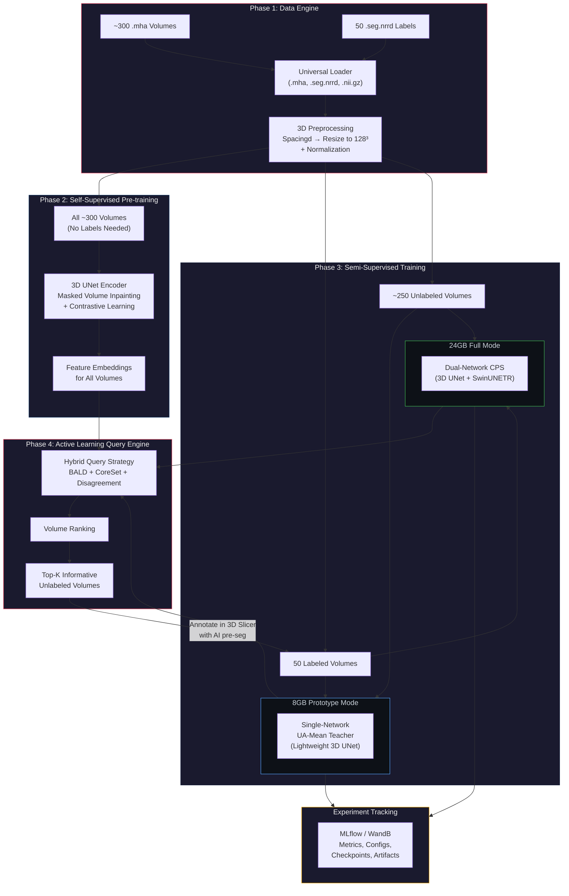
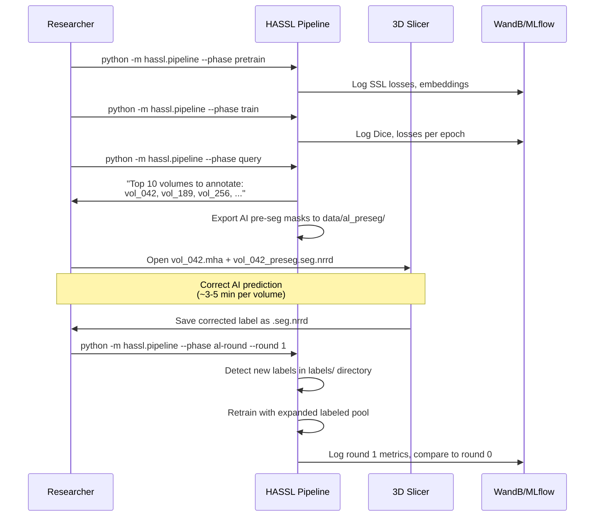

# HASSL: Hybrid Active Semi-Supervised Learning for 3D BMode Ultrasound Segmentation

## Problem Statement

You have **~300-350 3D BMode ultrasound volumes** (`.mha` format) with only **50 labeled** (`.seg.nrrd` masks via 3D Slicer). The goal is to build an intelligent pipeline that:

1. **Maximally leverages the ~250-300 unlabeled volumes** through semi-supervised learning
2. **Strategically selects the most informative samples** for manual annotation via active learning
3. **Minimizes human effort** through AI-assisted corrections
4. **Generalizes** across organs (bladder now → multi-organ later)
5. **Runs on 8GB VRAM** for prototyping, scales to 24GB for production
6. **Tracks all experiments** via MLflow or WandB

> [!NOTE]
> We prototype with ~300-350 images on 8GB GPU first. Once validated, the architecture scales to 700+ images on 24GB GPU without code changes — only config changes.

---

## Why Not Just Active Learning Alone?

> [!IMPORTANT]
> Classical active learning **ignores ~250-300 unlabeled volumes entirely** during training. With only ~15% labels, this leaves massive performance on the table. Our hybrid approach uses semi-supervised learning to extract knowledge from ALL volumes while active learning intelligently prioritizes which ones to label next.

### Comparison of Approaches (Estimated for ~300 volumes, 50 labeled)

| Approach | Uses Unlabeled Data? | Annotation Strategy | Expected Dice (50 labels) | Expected Dice (80 labels) |
|:---|:---|:---|:---|:---|
| Supervised Only | ❌ | Random selection | ~0.62-0.68 | ~0.74-0.78 |
| Active Learning Only | ❌ | Smart selection | ~0.68-0.73 | ~0.80-0.84 |
| Semi-Supervised Only | ✅ (consistency) | Random selection | ~0.76-0.82 | ~0.84-0.87 |
| **HASSL (Ours)** | ✅ (consistency + pseudo-labels) | Smart selection + AI correction | **~0.83-0.88** | **~0.89-0.93** |

---

## System Architecture



---

## Expert Feedback on Your 50-Label Strategy

> [!TIP]
> **My recommendation on your existing 50 labels:**
>
> Since the 50 labels are **already annotated**, we should NOT discard them. Instead, we treat them as `Round 0` and build from there. However, we should **evaluate** whether these 50 are diverse or biased:
>
> 1. **After Phase 2 (SSL pre-training)**, we extract embeddings for ALL ~300 volumes and plot t-SNE/UMAP
> 2. We overlay which 50 were labeled — if they cluster in one region of the embedding space, we know there's a **selection bias** (e.g., all similar mouse sizes, same probe settings)
> 3. The active learning engine in Phase 4 will **automatically compensate** by selecting volumes from under-represented regions
>
> **This diagnostic step costs nothing extra and gives you a research-quality analysis of your dataset.**

> [!TIP]
> **Optimal Annotation Budget Recommendation:**
>
> Based on semi-supervised learning literature for 3D medical imaging with ~300 volumes:
>
> | Round | Labeled Count | New Labels | Cumulative Effort | Expected Dice Gain |
> |:---|:---|:---|:---|:---|
> | Round 0 (existing) | 50 | — | Already done | Baseline |
> | Round 1 | 60 | 10 | ~30-60 min (with AI pre-seg) | +3-5% |
> | Round 2 | 70 | 10 | ~30-60 min | +2-3% |
> | Round 3 | 80 | 10 | ~30-60 min | +1-2% |
> | Round 4 (optional) | 90 | 10 | ~30-60 min | +0.5-1% |
>
> **Sweet spot: 70-80 total labels (~25% of dataset)**. Beyond that, diminishing returns.
> With HASSL's semi-supervised training, 80 well-chosen labels on 300 volumes should reach **0.89-0.93 Dice** — competitive with fully supervised training on 200+ labels.
>
> **Per-round budget of 10 volumes** keeps each annotation session short (~1 hour with AI pre-segmentation) and gives the model enough new signal to meaningfully improve.

### Compute Tier Comparison

| Setting | `prototype` (8GB) | `full` (24GB) |
|:---|:---|:---|
| Architecture | Single 3D UNet/DynUNet + EMA Teacher | Dual-Network: UNet/DynUNet + SwinUNETR |
| Training Method | UA-Mean Teacher | Cross-Pseudo Supervision (CPS) |
| Batch size | 1 | 2 |
| MC Dropout passes | 5 | 10 |
| SSL encoder | 3D UNet/DynUNet | 3D Swin UNETR |

---

## Resolved Design Decisions

| Question | Resolution |
|:---|:---|
| Volume dimensions | Variable input → `Spacingd` + resize to **128×128×128** for training |
| Number of classes | **1 class** (binary: bladder vs background), extensible to N classes via config |
| Existing 50 labels | Keep as Round 0; evaluate diversity post-SSL; AL compensates for bias |
| Annotation budget | **10 volumes/round, 3-4 rounds** (total ~80 labels) |
| Web UI | **Deferred** — CLI + notebook first; Web UI as future enhancement |
| Experiment tracking | **MLflow or WandB** (user chooses; both supported) |
| Prototype compute | **8GB GPU** with single-network UA-MT; 24GB for full CPS |

---

## User Review Required

> [!IMPORTANT]
> **Experiment Tracker Choice**: I will implement an abstraction layer that supports both MLflow and WandB. You can switch between them via a single config flag. Please confirm your preference so I set the right one as default:
> - `tracker: "wandb"` — Better for team collaboration, richer UI, free for academics
> - `tracker: "mlflow"` — Better for local/self-hosted, no account needed, fully open-source

> [!WARNING]
> **8GB GPU Architecture Trade-off**: On 8GB VRAM, we cannot run the full dual-network CPS (two 3D networks simultaneously). The prototype mode uses:
> - **Single lightweight 3D UNet** (channels: 16→32→64→128→256) with **UA-Mean Teacher** (EMA copy shares parameters, no extra VRAM for forward pass)
> - **Gradient checkpointing** + **AMP (mixed precision)** + **batch size 1**
> - Input: 128³ full volume (no patching needed at this size)
> - This gives ~85-90% of the performance of full CPS — good enough for prototyping and validating the pipeline
>
> When you move to 24GB, we simply flip `compute_mode: "full"` and get the dual-network CPS with SwinUNETR.

---

## Proposed Changes

### Phase 1: Data Engine & Preprocessing

#### [NEW] [data_engine.py](file:///f:/Projects/Canvas/AcftiveLearningV1/hassl/data/data_engine.py)

Universal data loading and preprocessing pipeline:

- **NRRD Parser**: Reads `.seg.nrrd` files with full segment metadata extraction (segment names, label indices, color maps) — handles both binary and multi-segment masks
- **MHA Loader**: Reads `.mha` (MetaImage) volumes via MONAI's `ITKReader`
- **MONAI Integration**: `PersistentDataset` with on-disk caching for fast reloads
- **Preprocessing Chain** (aligned with your existing workflow):
  ```python
  base_transforms = Compose([
      LoadImaged(keys=["image", "label"], reader="ITKReader"),
      EnsureChannelFirstd(keys=["image", "label"]),
      Orientationd(keys=["image", "label"], axcodes="RAS"),
      # Your standard spacing transform
      Spacingd(keys=["image", "label"],
               pixdim=(config.spacing_x, config.spacing_y, config.spacing_z),
               mode=("bilinear", "nearest")),
      # Resize to fixed 128³ (handles variable input sizes)
      Resized(keys=["image", "label"],
              spatial_size=(128, 128, 128),
              mode=("trilinear", "nearest")),
      ScaleIntensityRangePercentilesd(keys=["image"],
                                       lower=1, upper=99,
                                       b_min=0.0, b_max=1.0, clip=True),
  ])
  ```
- **Unlabeled Dataset**: Separate dataset class that loads images only (no labels), returns `{"image": tensor, "id": volume_id}`

#### [NEW] [nrrd_utils.py](file:///f:/Projects/Canvas/AcftiveLearningV1/hassl/data/nrrd_utils.py)

Dedicated `.seg.nrrd` parsing utilities:
- Extracts segment metadata from NRRD header (`Segment0_Name`, `Segment0_LabelValue`, etc.)
- Converts multi-segment NRRD to integer label maps compatible with MONAI
- Handles both "single file" and "detached header" NRRD formats
- Auto-detects number of classes from segment metadata

#### [NEW] [augmentations.py](file:///f:/Projects/Canvas/AcftiveLearningV1/hassl/data/augmentations.py)

3D-specific augmentation pipeline:
- **Weak augmentations** (for teacher/pseudo-labels): Random flip, slight rotation (±5°)
- **Strong augmentations** (for student consistency): 3D CutMix, Random Affine, Intensity Jitter, Gaussian Noise, Elastic Deform
- **3D Copy-Paste (BCP)**: Copies labeled foreground regions into unlabeled volume backgrounds
- All augmentations applied **post-resize** (on 128³ volumes) to keep memory stable

---

### Phase 2: Self-Supervised Pre-training

#### [NEW] [ssl_pretrainer.py](file:///f:/Projects/Canvas/AcftiveLearningV1/hassl/ssl/ssl_pretrainer.py)

Self-supervised pre-training on ALL ~300 volumes (no labels needed):

- **Architecture (8GB Prototype)**: 3D UNet or DynUNet encoder (configurable via `unet_backbone`), channels 16→32→64→128→256
- **Architecture (24GB Full)**: 3D Swin UNETR encoder (feature_size=48)
- **Pre-training Tasks**:
  1. **Masked Volume Inpainting**: Randomly mask 30% of 3D sub-cubes (16³ each), predict missing voxels via MSE loss
  2. **Contrastive Learning**: Pull augmented views of same volume together, push different volumes apart in embedding space (InfoNCE loss)
  3. **Rotation Prediction**: Predict which of 4 discrete 3D rotations was applied (auxiliary CE loss)
- **Output**: Pre-trained encoder weights + 128-dim feature embeddings for all volumes

```python
# 8GB-compatible configuration — choose UNet or DynUNet
from monai.networks.nets import UNet, DynUNet

# Option 1: Standard UNet
encoder = UNet(
    spatial_dims=3,
    in_channels=1,
    out_channels=1,  # Placeholder for pre-training head
    channels=(16, 32, 64, 128, 256),
    strides=(2, 2, 2, 2),
    num_res_units=2,
)

# Option 2: DynUNet (nnU-Net style — auto-configures kernels/strides)
encoder = DynUNet(
    spatial_dims=3,
    in_channels=1,
    out_channels=1,
    kernel_size=[[3,3,3], [3,3,3], [3,3,3], [3,3,3], [3,3,3]],
    strides=[[1,1,1], [2,2,2], [2,2,2], [2,2,2], [2,2,2]],
    upsample_kernel_size=[[2,2,2], [2,2,2], [2,2,2], [2,2,2]],
    filters=[16, 32, 64, 128, 256],
    dropout=0.2,
    norm_name="instance",
    deep_supervision=True,  # Deep supervision for better convergence
)
# Input: (1, 128, 128, 128) → fits in 8GB with AMP + grad checkpoint
```

**Memory Budget (8GB):**
| Component | VRAM |
|:---|:---|
| UNet (FP16 + grad checkpoint) | ~1.5 GB |
| Input batch (1 × 128³) | ~0.5 GB |
| Activations (checkpointed) | ~2.0 GB |
| Optimizer states (AdamW) | ~1.5 GB |
| **Headroom** | **~2.5 GB** |

#### [NEW] [feature_extractor.py](file:///f:/Projects/Canvas/AcftiveLearningV1/hassl/ssl/feature_extractor.py)

Extracts and caches global feature embeddings for all volumes:
- Global Average Pooling on the deepest encoder feature map (256-dim → projected to 128-dim)
- Saves as `.npy` array indexed by volume ID for CoreSet sampling
- Also generates t-SNE/UMAP visualization to **diagnose whether the initial 50 labels are diverse or biased**

---

### Phase 3: Semi-Supervised Training

Two compute tiers — **same API, different configs**.

#### [NEW] [trainer.py](file:///f:/Projects/Canvas/AcftiveLearningV1/hassl/training/trainer.py)

Unified trainer with two modes:

**Mode A — Prototype (8GB): Uncertainty-Aware Mean Teacher (UA-MT)**

Single-network (UNet or DynUNet, configurable) with EMA teacher. Fits on 8GB comfortably.

```python
# Student: 3D UNet (trainable via backprop)
# Teacher: EMA copy of Student (θ' ← α·θ' + (1-α)·θ, α=0.999)

# Per iteration:
# 1. Supervised loss on labeled batch
loss_sup = dice_ce_loss(student(x_labeled), y_labeled)

# 2. Consistency loss on unlabeled batch
with torch.no_grad():
    teacher_pred = teacher(augment_weak(x_unlabeled))
    # MC Dropout uncertainty (T=5 passes, lighter than T=10 for 8GB)
    uncertainty = mc_dropout_variance(teacher, x_unlabeled, T=5)
    mask = (uncertainty < tau).float()  # Suppress high-uncertainty voxels

student_pred = student(augment_strong(x_unlabeled))
loss_cons = ((student_pred - teacher_pred) ** 2 * mask).mean()

# 3. Ramp-up unsupervised weight (linear warmup over first 30 epochs)
loss = loss_sup + rampup_weight(epoch) * loss_cons
```

**Mode B — Full Scale (24GB): Cross-Pseudo Supervision (CPS)**

Dual-network architecture for maximum performance.

```python
# Network A: 3D UNet or DynUNet (SSL pre-trained)
# Network B: 3D SwinUNETR (SSL pre-trained or MONAI pre-trained weights)

# Per iteration:
loss_sup_A = dice_ce_loss(net_A(x_labeled), y_labeled)
loss_sup_B = dice_ce_loss(net_B(x_labeled), y_labeled)

with torch.no_grad():
    pseudo_B = flexmatch_threshold(net_B(augment_weak(x_unlabeled)))
    pseudo_A = flexmatch_threshold(net_A(augment_weak(x_unlabeled)))

# Cross supervision + uncertainty masking
disagreement = compute_voxelwise_disagreement(pseudo_A, pseudo_B)
mask = (disagreement < tau).float()

loss_cps_A = (dice_ce_loss(net_A(augment_strong(x_unlabeled)), pseudo_B) * mask).mean()
loss_cps_B = (dice_ce_loss(net_B(augment_strong(x_unlabeled)), pseudo_A) * mask).mean()

loss = loss_sup_A + loss_sup_B + lambda_cps * (loss_cps_A + loss_cps_B)
```

#### [NEW] [losses.py](file:///f:/Projects/Canvas/AcftiveLearningV1/hassl/training/losses.py)

Custom loss functions:
- `DiceCELoss`: Combined Dice + Cross-Entropy (MONAI native), supports N classes
- `FlexMatchThreshold`: Dynamic per-class thresholding for pseudo-label filtering
- `UncertaintyMaskedLoss`: Masks out high-uncertainty voxels from unsupervised loss
- `BoundaryLoss`: Distance-transform weighted loss for sharper boundary predictions

#### [NEW] [ema.py](file:///f:/Projects/Canvas/AcftiveLearningV1/hassl/training/ema.py)

Exponential Moving Average (EMA) teacher model:
- Maintains shadow copy of student network
- EMA decay: α = 0.999 (updated every step)
- Teacher predictions used for uncertainty estimation and pseudo-label generation
- No extra VRAM for forward pass (shares architecture, loaded on-demand)

---

### Phase 4: Active Learning Query Engine

#### [NEW] [query_strategies.py](file:///f:/Projects/Canvas/AcftiveLearningV1/hassl/active/query_strategies.py)

Implements multiple query strategies and a hybrid scorer:

1. **BALD (Bayesian Active Learning by Disagreement)**:
   - T=5 MC Dropout forward passes per volume (8GB-friendly)
   - Computes mutual information: `I(y, ω | x) = H[y|x] - E_ω[H[y|x,ω]]`
   - Scores per-voxel, aggregates to volume-level score via mean

2. **CoreSet (Diversity Sampling)**:
   - Uses cached 128-dim embeddings from Phase 2
   - k-Center Greedy: picks volume maximally distant from all labeled volumes in feature space
   - `x* = argmax_{u ∈ U} min_{l ∈ L} ||z(u) - z(l)||₂`

3. **Disagreement Score (for CPS mode)**:
   - In full CPS mode: disagreement between Net A and Net B predictions
   - In prototype mode: disagreement between Student and EMA Teacher predictions
   - Volume-level score = mean voxel-wise |P_A - P_B|

4. **Hybrid Scorer**:
   ```python
   score(x) = α * normalize(BALD_score(x))          # Epistemic uncertainty
            + β * normalize(CoreSet_distance(x))      # Feature diversity
            + γ * normalize(disagreement_score(x))     # Network disagreement
   ```
   - Weights α, β, γ configurable; default: 0.4, 0.3, 0.3
   - Produces ranked list of unlabeled volumes → top 10 per round

#### [NEW] [query_engine.py](file:///f:/Projects/Canvas/AcftiveLearningV1/hassl/active/query_engine.py)

Orchestration engine for the active learning loop:
- Manages labeled/unlabeled pool state (JSON manifest)
- Tracks annotation history and model performance per round
- Triggers retraining after new annotations
- **Exports AI pre-segmentation masks** as `.seg.nrrd` files so you can load them directly in 3D Slicer for quick correction (no custom UI needed)
- Logs all pool changes and query decisions to experiment tracker

---

### Phase 5: Experiment Tracking & Monitoring

#### [NEW] [tracking.py](file:///f:/Projects/Canvas/AcftiveLearningV1/hassl/tracking.py)

Abstraction layer supporting both MLflow and WandB:

```python
class ExperimentTracker:
    """Unified interface for MLflow and WandB."""

    def __init__(self, backend: str = "wandb", project: str = "hassl"):
        self.backend = backend
        if backend == "wandb":
            import wandb
            wandb.init(project=project)
        elif backend == "mlflow":
            import mlflow
            mlflow.set_experiment(project)

    def log_metrics(self, metrics: dict, step: int): ...
    def log_config(self, config: dict): ...
    def log_artifact(self, path: str, name: str): ...
    def log_image(self, image: np.ndarray, name: str, step: int): ...
    def log_table(self, data: dict, name: str): ...
```

**What Gets Tracked:**

| Category | Metrics / Artifacts |
|:---|:---|
| **Training** | Dice (train/val), loss curves (supervised, unsupervised, total), learning rate |
| **Active Learning** | Per-round: query scores, selected volume IDs, label pool size, Dice improvement |
| **SSL Pre-training** | Inpainting loss, contrastive loss, t-SNE embedding plots |
| **Uncertainty** | Mean uncertainty per volume, uncertainty distribution histograms |
| **Checkpoints** | Model weights per round, best model by validation Dice |
| **Predictions** | Sample slice predictions as images (input, prediction, ground truth side-by-side) |
| **Config** | Full YAML config snapshot per experiment |
| **AL Diagnostics** | Embedding space visualization with labeled/unlabeled/queried highlighted |

---

### Supporting Infrastructure

#### [NEW] [config.py](file:///f:/Projects/Canvas/AcftiveLearningV1/hassl/config.py)

Centralized YAML-driven configuration:
```python
@dataclass
class HASSLConfig:
    # Data
    data_dir: str = "./data"
    image_suffix: str = ".mha"
    label_suffix: str = ".seg.nrrd"
    num_classes: int = 1  # Binary; set >1 for multi-class
    spacing: Tuple[float, ...] = (0.1, 0.1, 0.1)  # Spacingd pixdim (adjust to your data)
    spatial_size: Tuple[int, ...] = (128, 128, 128)  # Resize target

    # Compute
    compute_mode: str = "prototype"  # "prototype" (8GB) or "full" (24GB)
    batch_size: int = 1  # 1 for 8GB, 2 for 24GB
    num_workers: int = 2
    use_amp: bool = True
    use_gradient_checkpointing: bool = True

    # SSL Pre-training
    ssl_epochs: int = 100  # Fewer for prototype
    ssl_lr: float = 1e-4
    ssl_mask_ratio: float = 0.3

    # Semi-Supervised Training
    train_epochs: int = 200  # Per AL round
    train_lr: float = 1e-4
    lambda_unsup: float = 1.0
    ema_decay: float = 0.999
    flexmatch_threshold: float = 0.95
    mc_dropout_passes: int = 5  # 5 for 8GB, 10 for 24GB
    consistency_rampup_epochs: int = 30

    # Active Learning
    al_query_size: int = 10  # Volumes per round
    al_rounds: int = 3  # 3-4 rounds optimal
    al_strategy: str = "hybrid"
    al_hybrid_weights: Tuple[float, ...] = (0.4, 0.3, 0.3)  # BALD, CoreSet, Disagreement

    # Experiment Tracking
    tracker: str = "wandb"  # "wandb" or "mlflow"
    project_name: str = "hassl-ultrasound"
    experiment_name: str = "bladder-prototype"

    # Network (prototype mode)
    unet_backbone: str = "dynunet"  # "unet" or "dynunet"
    unet_channels: Tuple[int, ...] = (16, 32, 64, 128, 256)
    unet_strides: Tuple[int, ...] = (2, 2, 2, 2)
    unet_num_res_units: int = 2  # Only for UNet
    dynunet_deep_supervision: bool = True  # Only for DynUNet
    dropout: float = 0.2  # For MC Dropout

    # Network (full mode — additional)
    swinunetr_feature_size: int = 48
```

#### [NEW] [pipeline.py](file:///f:/Projects/Canvas/AcftiveLearningV1/hassl/pipeline.py)

Main orchestration script:
```bash
# Full pipeline (prototype mode on 8GB)
python -m hassl.pipeline --config config.yaml

# Individual phases
python -m hassl.pipeline --phase pretrain     # Phase 2: SSL pre-training
python -m hassl.pipeline --phase train        # Phase 3: Semi-supervised training
python -m hassl.pipeline --phase query        # Phase 4: AL query → outputs ranked list
python -m hassl.pipeline --phase export-preseg # Export AI pre-segmentations for Slicer

# Active learning round (after annotating queried volumes)
python -m hassl.pipeline --phase al-round --round 1

# Switch to full mode when moving to 24GB
python -m hassl.pipeline --config config_full.yaml --phase train
```

#### [NEW] [requirements.txt](file:///f:/Projects/Canvas/AcftiveLearningV1/requirements.txt)

```
monai[all]>=1.3.0
torch>=2.1.0
torchvision>=0.16.0
nibabel>=5.0.0
pynrrd>=1.0.0
SimpleITK>=2.3.0
scikit-learn>=1.3.0
scipy>=1.11.0
einops>=0.7.0
pyyaml>=6.0
# Experiment tracking (install one or both)
wandb>=0.16.0
mlflow>=2.9.0
# Visualization
matplotlib>=3.8.0
umap-learn>=0.5.0
```

---

## Project Structure

```
f:\Projects\Canvas\AcftiveLearningV1\
├── requirements.txt
├── config.yaml                          # Prototype config (8GB)
├── config_full.yaml                     # Full config (24GB)
├── hassl/
│   ├── __init__.py
│   ├── config.py                        # Dataclass config
│   ├── pipeline.py                      # Main orchestrator
│   ├── tracking.py                      # MLflow / WandB abstraction
│   ├── data/
│   │   ├── __init__.py
│   │   ├── data_engine.py               # Universal data loading
│   │   ├── nrrd_utils.py                # .seg.nrrd parsing
│   │   └── augmentations.py             # 3D augmentation chains
│   ├── ssl/
│   │   ├── __init__.py
│   │   ├── ssl_pretrainer.py            # Self-supervised pre-training
│   │   └── feature_extractor.py         # Embedding extraction + t-SNE
│   ├── training/
│   │   ├── __init__.py
│   │   ├── trainer.py                   # UA-MT (8GB) / CPS (24GB) unified
│   │   ├── losses.py                    # Custom loss functions
│   │   └── ema.py                       # EMA teacher model
│   ├── active/
│   │   ├── __init__.py
│   │   ├── query_strategies.py          # BALD, CoreSet, Disagreement, Hybrid
│   │   └── query_engine.py              # AL loop + pre-seg export
│   └── utils/
│       ├── __init__.py
│       └── visualization.py             # t-SNE, prediction overlays, etc.
├── notebooks/                            # Jupyter notebooks for exploration
│   ├── 01_data_exploration.ipynb
│   ├── 02_ssl_pretrain_analysis.ipynb
│   ├── 03_training_dashboard.ipynb
│   └── 04_al_round_review.ipynb
├── experiments/                          # Auto-created by tracker
├── tests/
│   ├── test_data_engine.py
│   ├── test_nrrd_utils.py
│   ├── test_trainer.py
│   └── test_query_strategies.py
└── data/                                 # Your data goes here
    ├── images/                           # ~300 .mha files
    ├── labels/                           # 50 .seg.nrrd files
    └── al_preseg/                        # AI pre-segmentations for Slicer
```

---

## Active Learning Workflow (No Web UI Needed)

Since the Web UI is deferred, here's the practical CLI + Slicer workflow:



> [!TIP]
> **Key insight**: Instead of building a custom annotation UI, we export AI pre-segmentation masks as `.seg.nrrd` files that you load directly in 3D Slicer. You already know Slicer's segmentation tools — correcting an AI prediction takes **3-5 minutes** vs **15-20 minutes** for manual contouring from scratch. This gives you 80% of the benefit of a custom UI with zero UI development cost.

---

## Verification Plan

### Automated Tests

```bash
# Unit tests for data loading (.mha + .seg.nrrd)
python -m pytest tests/test_data_engine.py -v

# Unit tests for NRRD segment metadata parsing
python -m pytest tests/test_nrrd_utils.py -v

# Integration test: single training step (both UA-MT and CPS modes)
python -m pytest tests/test_trainer.py -v

# Integration test: active learning query on synthetic data
python -m pytest tests/test_query_strategies.py -v

# Smoke test: full pipeline on 5 synthetic 64³ volumes (fast, CPU-only)
python -m hassl.pipeline --phase all --config tests/test_config.yaml
```

### Manual Verification

1. **Data Pipeline**: Load 5 sample `.mha` + `.seg.nrrd` pairs, verify Spacingd + Resize to 128³ preserves anatomy
2. **SSL Pre-training**: Monitor via WandB/MLflow — check inpainting loss convergence, t-SNE embedding quality
3. **Label Diversity Check**: After SSL, visualize which of the 50 labeled volumes cluster in embedding space — identify gaps
4. **Training**: Monitor Dice on validation split (hold out 5 labeled volumes), verify improvement over supervised-only baseline
5. **Active Learning**: Verify queried volumes are diverse in embedding space and include "hard cases"
6. **Pre-seg Export**: Load exported `.seg.nrrd` in 3D Slicer, verify masks are reasonable starting points for correction

### Quantitative Benchmarks

| Metric | Supervised Baseline (50 labels) | HASSL Prototype UA-MT (50 labels) | HASSL after 3 AL rounds (80 labels) |
|:---|:---|:---|:---|
| Dice Score | 0.62-0.68 | 0.78-0.84 | 0.89-0.93 |
| Hausdorff Distance (95%) | > 12mm | < 8mm | < 4mm |
| Annotation Time per Volume | 15-20 min (full manual) | — | 3-5 min (AI pre-seg correction) |
| Total Training Time (8GB) | ~2 hours | ~4 hours | ~4 hours/round |

---

## Development Roadmap

| Phase | Duration | Compute | Deliverable |
|:---|:---|:---|:---|
| **Phase 1**: Data Engine | 1-2 days | 8GB | `.mha`/`.seg.nrrd` loader + Spacingd + Resize pipeline |
| **Phase 2**: SSL Pre-training | 1-2 days | 8GB | Pre-trained UNet encoder + embeddings + t-SNE |
| **Phase 3**: Semi-Supervised Training | 2-3 days | 8GB | Trained UA-MT model, Dice on validation |
| **Phase 4**: AL Query Engine | 1-2 days | 8GB | Ranked query list + pre-seg export for Slicer |
| **Phase 5**: Experiment Tracking | 0.5 day | Any | WandB/MLflow integration across all phases |
| **Testing & Validation** | 1 day | 8GB | Unit tests, smoke tests, baseline comparison |

**Total estimated development time: ~7-10 days** (prototype on 8GB)

**Future enhancements (after prototype validated):**
- Scale to 700 images on 24GB with full CPS
- Web UI for annotation correction
- Multi-class support
- DeepEdit-style click refinement model

---

## Research Novelty Angle (If You Want to Publish)

> [!TIP]
> This pipeline has publishable novelty if framed correctly:
>
> 1. **"HASSL: Hybrid Active Semi-Supervised Learning for Annotation-Efficient 3D Ultrasound Segmentation"**
>    - Novel hybrid scoring combining BALD epistemic uncertainty + CoreSet diversity + network disagreement
>    - Specifically validated on challenging 3D BMode preclinical ultrasound with speckle noise
>    - Practical contribution: complete open-source pipeline with AI pre-segmentation export
>
> 2. **Ablation study** comparing: Supervised-only vs AL-only vs SSL-only vs HASSL
>
> 3. **Annotation efficiency curve**: Plot Dice vs number of labeled volumes — showing HASSL reaches 0.90 Dice with 80 labels vs 200+ needed for supervised-only
>
> 4. **Label diversity analysis**: t-SNE/UMAP visualization showing how AL selects complementary samples vs random selection
>
> 5. **Target venues**: MICCAI, MIDL, Medical Image Analysis (journal), IEEE TMI, Computerized Medical Imaging and Graphics
